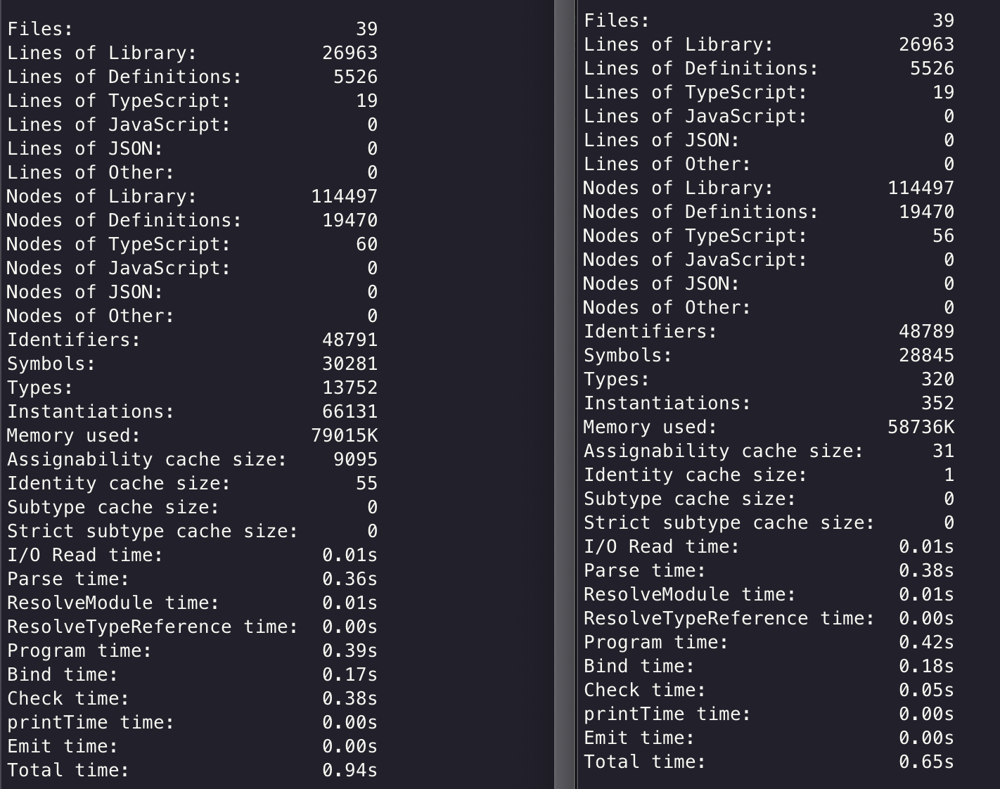

## Typescript performance issue when prisma is used in an inferred argument along-side a generic

I have noticed that there is significant overhead when using large objects (like the prisma client) along side generics.

This repo has a small reproduction of the issue. I'm not sure if it's technically a bug, but I am hoping there is a way to optimize this case.

## Reproduction steps:

To generate diagnostics with the problem present:

```bash
npm install
npm run type
```

Comparison without generic:

Replace `createField` in `index.ts` with commented out version and run `npm run type` again.

Results:

Version with generic is on the left:

